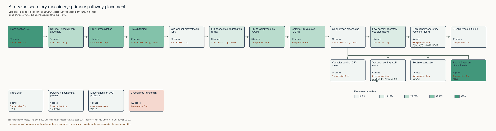

# A. oryzae Secretory Pathway Atlas

**Description:** The atlas covers the 369 secretion-machinery genes catalogued by Liu et al. in 2014. It connects the old gene records from Liu et al. to current databases (NCBI RefSeq, KEGG, and UniProt) so they can be found and used with today’s tools. It also organizes the genes by their role and location in the secretion pathway, highlights the genes that responded consistently during high protein secretion, and records uncertainty where evidence is incomplete. The results are provided as searchable tables and a pathway diagram.

**Scope:** This atlas covers Liu et al.’s 369 secretion-machinery genes—not all ~12,000 *A. oryzae* genes.

- It does not add genes identified or reannotated since 2014.
- Secreted proteins, proteases, and glycosyltransferases outside Liu’s list are absent; `alpA`, `npI`, and `npII` are examples.
- Liu’s predicted secretome in supplementary Table S3 is also out of scope.
- The contribution is making an existing dataset usable and understandable, not discovering new genes.

## Start here

| File | Purpose |
|---|---|
| [`high_secretion_responsive_genes.csv`](data/processed/high_secretion_responsive_genes.csv) | The 51 machinery genes consistently changed in all three secretion strains. |
| [`secretion_machinery_genes.csv`](data/processed/secretion_machinery_genes.csv) | Liu's complete 369-row machinery list, one biological gene per row. |
| [`column_descriptions.csv`](data/processed/column_descriptions.csv) | Definitions, allowed values, and provenance for every atlas column. |
| [`FINDINGS.md`](data/processed/FINDINGS.md) | A concise, evidence-bounded interpretation of the current atlas. |

The pathway diagram shows where Liu's genes fit in secretion and how many responded; [open the SVG](data/processed/pathway_overview.svg) for the full-size version.



## How it works

| Step | What happens | Main output |
|---|---|---|
| **1. Read the source** | Load the gene list from Liu's 2014 supplementary spreadsheet, keep every original cell intact, and confirm the published expression results reproduce. | Cleaned copy of the source data, plus a report on anything that did not parse |
| **2. Update the gene IDs** | Liu's gene identifiers are from 2014. Match each one to its current entry in UniProt, KEGG, and NCBI so the genes can be looked up in today's tools. | A mapping table connecting old IDs to current ones |
| **3. Build the atlas** | Add each gene's stage in the secretion pathway, its location in the cell, its glycosylation role, and a record of how confident we are and why. | The final gene table, the 51-gene shortlist, and the pathway diagram |

### Where the atlas fields come from

The atlas brings together three kinds of information:

- **What Liu reported in 2014:** the original gene ID, description, yeast counterpart, and expression results.
- **What current databases say:** the gene's current ID, protein name, KEGG group, and updated description.
- **Labels added by this project:** where the gene fits in the secretion pathway, whether it is involved in glycosylation, how strong the evidence is, how confidently the old ID was matched, and a short explanation of the decision.

These labels are created by comparing the available sources, not by guessing. For old gene IDs, direct links in trusted databases are used first. Sequence matching is only used when a reliable old sequence is available. If the evidence is unclear, the gene is flagged for review instead of being forced into a match.

The original supplementary inputs are retained under [`data/raw/liu2014/`](data/raw/liu2014/); see its README for provenance.

## Current numbers

| Measure | Count | What it means |
|---|---:|---|
| Machinery genes | 369 | The full set catalogued by Liu in 2014. |
| Consistently responsive genes | 51 | Expression changed in all three high-secretion strains: 48 increased and 3 decreased. |
| Genes assigned to a subsystem | 247 | A subsystem is a stage or branch of the secretion pathway. The other 122 lack enough evidence for placement in the pathway itself and remain grouped as unassigned. |
| Genes with a known compartment | 180 | The other 189 do not yet have a confident cellular location. |
| Genes with a KEGG Orthology group | 330 | A KEGG Orthology group connects genes with equivalent functions across species and makes them easier to compare in current databases. |

## Project status

All three notebooks run successfully. KEGG access works, 330 of the 369 genes have a KEGG Orthology (KO) identifier, and both SVG and PNG visualizations are rendered.

## Outputs

<details>
<summary>Full processed file inventory</summary>

| File | Grain | Contents |
|---|---|---|
| `secretion_machinery_genes.csv` | One row per machinery gene | Liu's 369-gene list with identifiers, primary and reviewed secondary subsystem roles, annotations, expression flags, and provenance. |
| `high_secretion_responsive_genes.csv` | One row per responsive machinery gene | The 51 genes significant in all three Liu comparisons. |
| `glycosylation_genes.csv` | One row per machinery gene with an assigned glycosylation role | Conservative assembly, transfer, trimming, Golgi, O-glycosylation, and GPI annotations. |
| `gene_id_mapping.csv` | One row per gene–identifier mapping | Current locus, UniProt, KEGG, and NCBI identifier links, including alternate candidates. |
| `column_descriptions.csv` | One row per output field | Data dictionary generated from `atlas/schema.py`, including vocabulary and provenance. |

| File | Contents |
|---|---|
| `pathway_overview.svg` | Standalone vector overview with definitions, counts, citation, confidence note, and build date. |
| `pathway_overview.png` | GitHub-friendly raster rendering of the same overview. |
| `FINDINGS.md` | Human-readable response pattern, candidates, complex checks, absent responses, and limitations. |

`data/processed/qa/` holds the build audit, a coverage summary, the review queue, and a 20-gene sample comparing Liu's original cells to the derived atlas fields.

</details>

## Data dictionary

The full dictionary is in [`column_descriptions.csv`](data/processed/column_descriptions.csv); its `source` column marks each field as Liu-derived, fetched, or generated. The less obvious fields are summarized here:

<!-- DATA_DICTIONARY_START -->
| Field | Definition | Allowed values |
|---|---|---|
| evidence_source | Normalized strength/type of functional evidence. | a_oryzae_experimental &#124; a_oryzae_transcriptomic &#124; aspergillus_homolog &#124; yeast_inference &#124; database_prediction &#124; unknown |
| subsystem_source | Primary evidence route used for the subsystem; supporting evidence chains are recorded in subsystem_rationale. | liu2014 &#124; liu2014_description &#124; yeast_scaffold &#124; current_annotation &#124; kegg_pathway &#124; curated_liu_composite &#124; aspergillus_homolog &#124; unassigned |
| mapping_status | Outcome of current-identifier resolution. | exact &#124; cross_reference &#124; sequence &#124; orthology &#124; ambiguous &#124; split &#124; merged &#124; unresolved |
| sig_all_three | True when all three Liu adjusted p-values are below 0.05. | true &#124; false |
| glycosylation_role | Specific glycosylation process assigned to the gene. | n_glycan_assembly &#124; n_glycan_transfer &#124; n_glycan_trimming &#124; golgi_mannosylation &#124; o_glycosylation &#124; gpi_anchor &#124; none |
| manual_review_required | Whether automated evidence requires human review. | true &#124; false |
<!-- DATA_DICTIONARY_END -->

## Verification

The notebooks rebuild the atlas from the original Liu 2014 files and check that all 369 genes reach the final output without being lost or duplicated. They also check that Liu’s original values, such as gene descriptions, yeast matches, and expression results, remain unchanged.

The old gene IDs were checked separately against current NCBI, KEGG, and UniProt records. For 368 genes, the same `AO090...` ID still appeared in current databases and referred to the same A. oryzae gene. One ID could not be found in any of the three databases, so it was left unresolved rather than guessed.

Windows PowerShell:

```powershell
python -m venv .venv
.venv\Scripts\Activate.ps1
python -m pip install -r requirements.txt
python -m pytest -q
```

macOS/Linux:

```bash
python3 -m venv .venv
source .venv/bin/activate
python -m pip install -r requirements.txt
python -m pytest -q
```

Then execute `notebooks/01_profile_liu2014.ipynb`, `02_fetch_and_crosswalk.ipynb`, and `03_build_component_table.ipynb` in order.

## Licensing

KEGG data is fetched at runtime and bulk responses are not redistributed; UniProt annotations use CC BY 4.0 and NCBI data is public domain. Liu and Feizi supplementary files retain their original publication terms and should be cited when reused.

## Citation

Primary source: Liu et al. (2014), *Genome-scale analysis of the high-efficient protein secretion system of Aspergillus oryzae*, *BMC Systems Biology* 8:73, DOI [`10.1186/1752-0509-8-73`](https://doi.org/10.1186/1752-0509-8-73).

Yeast scaffold: Feizi et al. (2013), *Genome-Scale Modeling of the Protein Secretory Machinery in Yeast*, DOI [`10.1371/journal.pone.0063284`](https://doi.org/10.1371/journal.pone.0063284).
